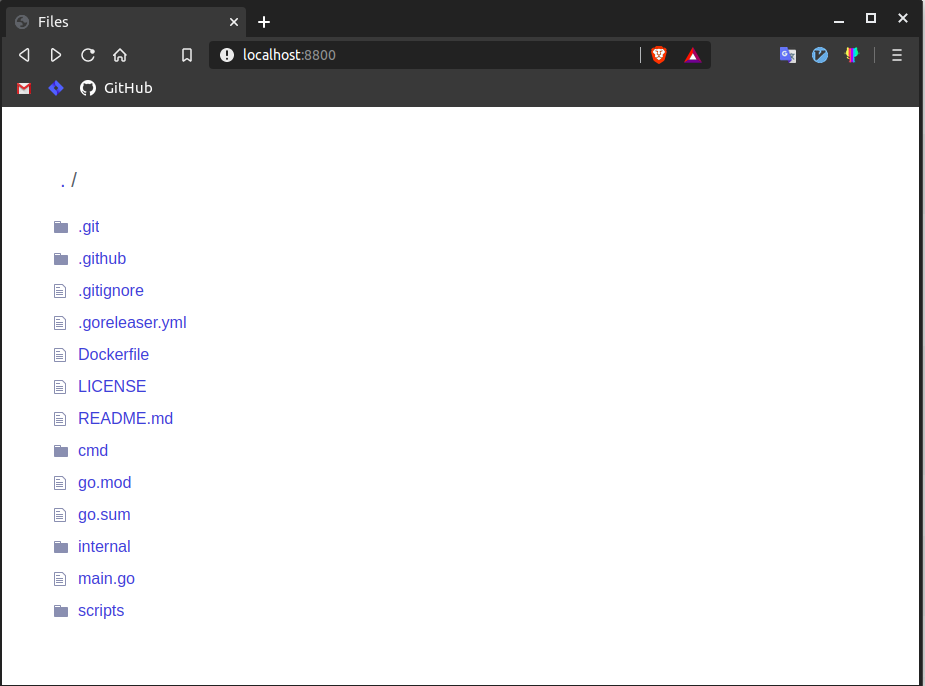
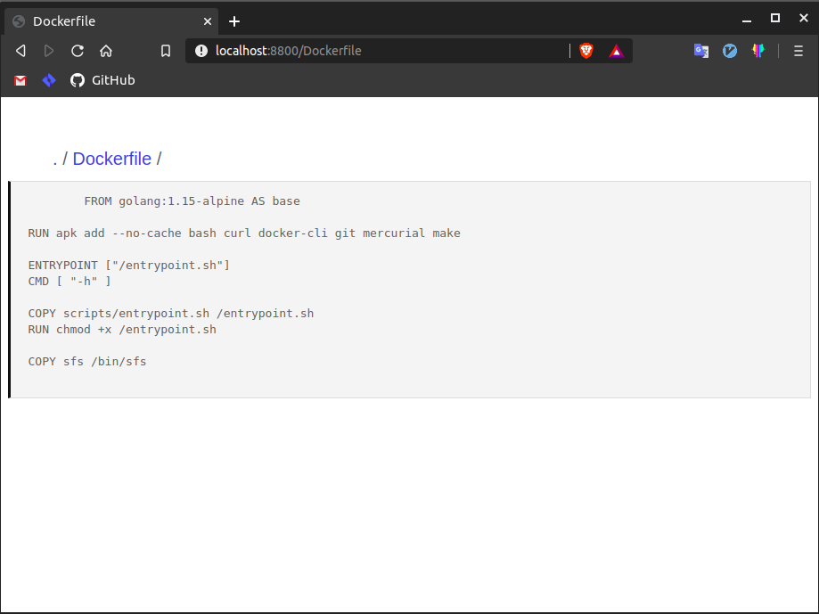

# sfs

A simple static file serving command-line tool.

## Install

### Docker

```sh
$ docker run --rm --privileged wesleimp/sfs
```

### Compiling from source

**clone**

```sh
$ git clone git@github.com:wesleimp/sfs.git

$ cd sfs
```

**download dependencies**

```sh
$ go mod download
```

**build**

```sh
$ go build -o sfs main.go
```

**verify it works**

```sh
$ sfs --help
```

## Screenshots

**folder**



**file content**



## LICENSE

[MIT](https://github.com/wesleimp/sfs/blob/master/LICENSE)